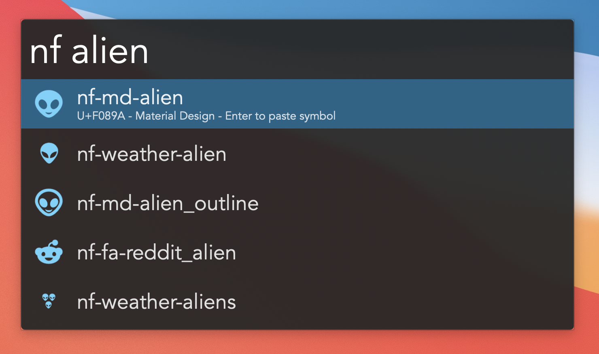

# Alfred Nerd Fonts

Search Nerd Font symbols in Alfred, choose one, and paste its UTF-8 character into the frontmost macOS app.



## Install

Download the latest workflow package:

[Download Nerd Fonts.alfredworkflow](https://github.com/markjaquith/alfred-nerd-fonts/releases/latest/download/Nerd%20Fonts.alfredworkflow)

Double-click the downloaded file to install it in Alfred. Then invoke Alfred and type `nf leaf`.

The first search that returns new symbols may pause briefly while PNG previews are cached in the installed workflow folder. After that, previews are reused.

Hold `Cmd` while selecting a result to paste the Nerd Font class name instead. Hold `Option` while selecting to paste the Unicode codepoint.

## Files

- `update-icons.py` downloads Nerd Fonts' generated CSS from the `gh-pages` branch and builds `data/nerd-font-glyphs.json`.
- `update-icons.py` also downloads `SymbolsNerdFontMono-Regular.ttf` and its license, which are used only for preview rendering.
- `render-icon.swift` renders cached PNG previews for Alfred result icons.
- `nerd-fonts-search.py` is the Alfred Script Filter. It reads the JSON index and returns Alfred items with cached preview icons.
- `icon.png` is the Alfred workflow icon. The editable source is `assets/workflow-icon.svg`.

## Refresh The Icon Index

```sh
/usr/bin/python3 update-icons.py
```

## Build A Distributable Workflow

```sh
/usr/bin/python3 build-workflow.py
```

This writes a self-contained workflow package to `dist/Nerd Fonts.alfredworkflow`. The package includes the scripts, glyph index, preview font, workflow icon, and a precompiled preview renderer when `swiftc` is available at build time.

## Font Note

Alfred results use rasterized PNG previews, so Alfred itself does not need to use a Nerd Font. The pasted symbols are still private-use Unicode characters. They only display correctly in target apps or fields using a Nerd Font, or when macOS can fall back to one. If pasted symbols look like boxes, install/use a Nerd Font such as `Symbols Nerd Font Mono` or set the target app to a Nerd Font.
